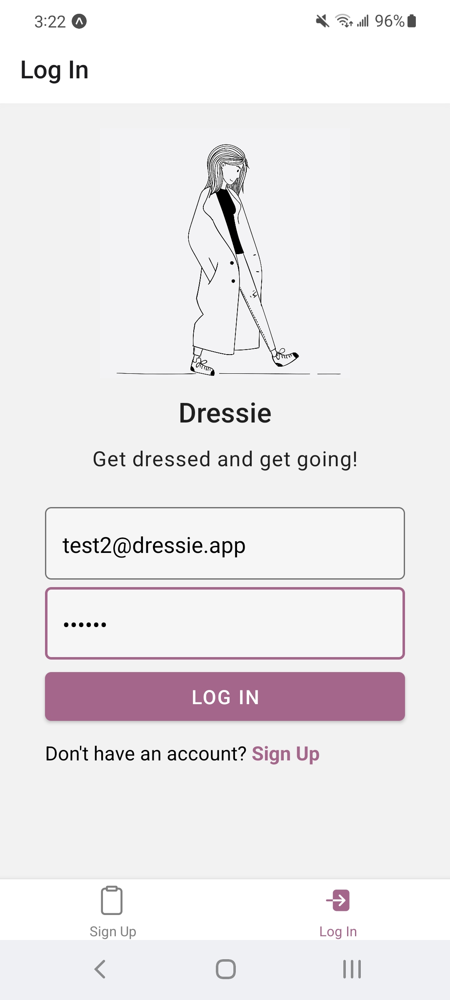

# Dressie

## Introduction

Dressie is a mobile app which aims to serve as your personal stylist for everyday needs and special events!

Dressie simplifies the sometimes hectic and stressful process of getting ready by generating personalized outfit recommendations.

## Tech Stack

- TypeScript
- React Native
- Firebase (Authentication, Firestore NoSQL DB, Google Cloud Storage)
- Expo (deployment, geolocation, facilitation of image uploads)
- OpenWeather API

## Features

As a user, I can:

- Create an account and log back in.
- Get outfit recommendations based on the current weather at my given location.
- Upload items from my IRL wardrobe.
- Get outfit recommendations which utilize items from my personal wardrobe.

**Item Upload Screen**

**Weather-Based Outfit Recommendation Screen**

### Next Steps

- Enable users to edit wardrobe items after they have been uploaded.
- Create a more robust personalized experience.
- Integrate a calendar so users can plan outfits for certain events.
- Allow users to save recommended outfits and view them later.
- & more!

---

<a href="https://pixabay.com/users/saydung89-18713596/">Art credit for login screen logo</a>
